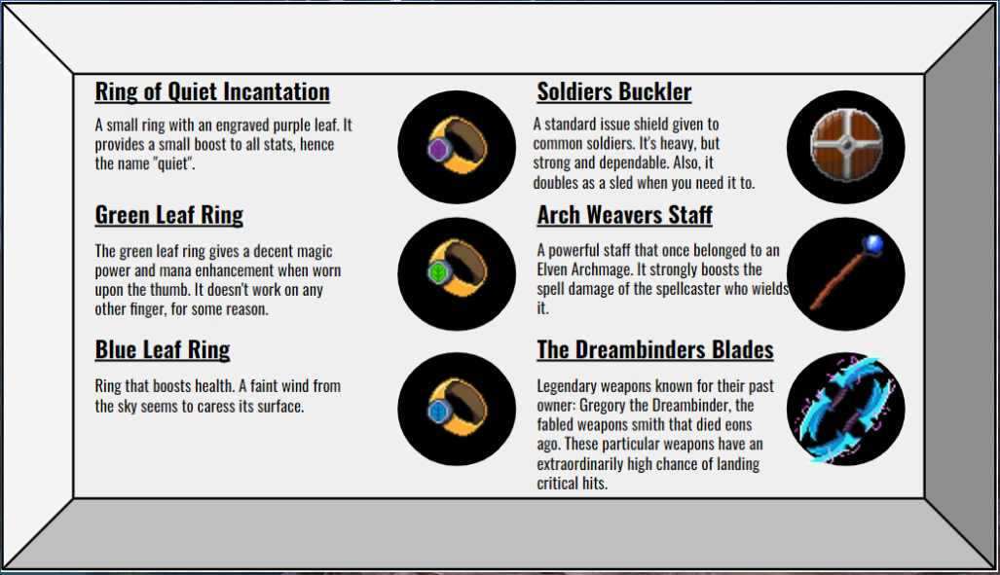

#Welcome #to #the #Obsidian #Tears #Project

Our Mission is to create a great game that entertains, uplifts, and shares our loves or the 2D classic genre that reminds us of our childhood and the good times! We hope you will find it does the same for you as it has for us.

Obsidian Tears is a 2D NFT RPG with original art, music, story, and adventure. The game is released in chapters as development completes. Taking place in the world of Eli' Alan, Obsidian Tears features a main character, Phendrin, who is on a quest to save his people from a growing threat. To do so, he must level up in skill, power, find and utilize artifacts, and decipher an ancient prophecy recorded on obelisks. 

Originally founded by Bob Bodily, then carried through by a group of friends, enthusiasts, and people who just won't quit, we offer Obsidian Tears to the world as pocket of nostaligia combined with the utility and benefits offered on the Internet Computer Blockchain. 

We are grateful to Dfinity for helping us on our journey through their grant program, and we are grateful for the opportunity to share the space with so many forward facing projects, teams, and people. 

We are happy to offer our codebase as an open source project. We hope to include the community increasingly, over time. We have exciting things in the works.

Each of our repositories offers a more techincal overview of how to utilize the repository and code base we have built. 

Website: https://obsidiantears.xyz/
Twitter: https://twitter.com/obsidian__tears

